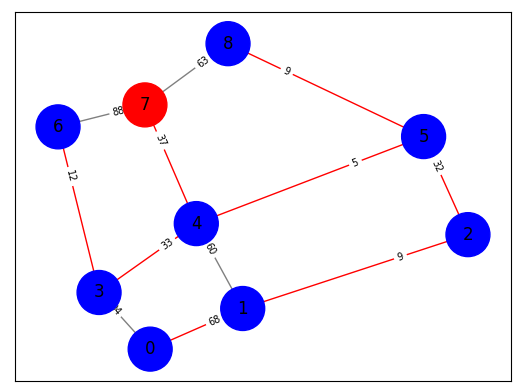
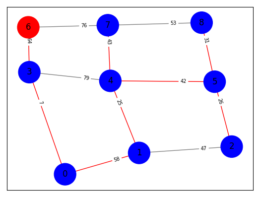

# Grafové úlohy #1

## Motivace pro grafové úlohy

- Sociální sítě
  - Facebook, Instagram (vztahy mezi lidmi; lidi, které možná znáte)
  - Youtube, Spotify (personalizovaný obsah)
- CSFD, IMDB
- E-shop
  - Společné nákupy různých uživatelů je profiluje (Společně s tímto lidé nakoupili také)
  - Doporučovací systémy
- Dopravní sítě
- Optimalizace při stavbě
- Navigace (optimalizace podle: vzdálenosti, rychlosti, ekonomičnosti...)

## Implementace grafu

Implementujte graf pomocí seznamu sousednosti. Využijte poskytnutou předlohu abyste byli schopni využít vizualizační nadstavby.

1. Nainstalujte si pomocný nástroj adthelper - https://github.com/JakubSido/adthelpers.

2. Vyplňte třídu pro reprezentaci grafu.
    - Vrcholy identifikujeme nezápornými čísly
    - Třída obsahuje seznam sousednosti
        - Na indexu vrcholu nalezneme seznam sousedních hran
        - Každá hrana je uložena jako tuple s váhou hrany a ID sousedního uzlu

    ```python
    class Graph:
        def __init__(self) -> None:
            self.edges: dict[int,list[tuple[float, int]]] = {}
    ```

3. vyplňte funkcionalitu přidávání hran do grafu

    ```python
    def add_edge(self, src: int, dst: int, weight: float = 0) -> None:
    ```

4. Napište funkci `load_graph`, která načte graf ze souboru ve formátu json. Použijte balík json. Ve složce 'data' je k dispozici více grafů různých velikostí pro testování.
    - Ve vstupních souborech můžete ignorovat definice uzlů

    např : graph_grid_s3.json

    

5. Pokud dodržíte rozhraní ze zadání, v tuto chvíli by měla fungovat vizualizace grafu. Příklad použití knihovničky:

    - Jednoduše pro graf

      ```python
      painter = adthelpers.painter.Painter(graph) 
      ```

    - pro vizualizace průběhu algoritmu

        ```python
            painter = adthelpers.painter.Painter(
                graph,
                visible=queue, # Prioritní fronta
                closed=closed, # množina uzavřených uzlů
                color_edges=spanning_tree, # aktuální kostra
                wait_for_key=False  # neblokující draw_graph(): animaci budeme řídit během např. debugerem
            )
            painter.draw_graph(actual_node)
        ```

6. Implementujte funkci `spanning_tree` pro hledání minimální kostry grafu za pomoci níže popsaného algoritmu.

## Prim-Jarníkův algoritmus

Najde minimální kostru. Implementujte Prim-Jarníkův algoritmus pomocí námi implementované reprezentace grafu

- Co je kostra?
- Záleží kde začnu?

## Algoritmus

Algoritmus pracuje s množinou objevených uzlů a hran k nim vedoucích

1. Vyberu počáteční uzel
2. Vyberu hranu $e^⋆$, která vede do neuzavřeného uzlu V. Přidám $e^⋆$ do kostry.
    - Všechny hrany, které vedou z uzlu $V$ přidám do fronty.
    - Uzel uzavřu

    Algoritmus pracuje s
    - Množinou hran – již objevenou kostrou
    - Množinou hran, které vedou z kostry ven (tudy můžeme rozšiřovat)
    - hledáme vždy tu nejlevnější tedy je vhodné použít prioritní frontu (PriorityQueue z balíku queue)
    - do prioritní fronty přidávejme hranu jako tuple (weight, (from_id, to_id),)


## K zamyšlení

1. co kdybychom nepoužili prioritní frontu? dostaneme kostru? A/N
2. jakou kostru dostaneme?

3. Jaký je vztah mezi mezi kostrou a nejkratší cestou?
4. Je např. pravda, že po kostře vede nejkratší cesta mezi vrcholy?

5. Ohodnocení hrany může mít různé významy:
    - hledám nejkratší cestu? potom jsou to asi kilometry
    - hledám nejrychlejší cestu? může mne zajímat i povolená rychlost na daném úseku
    - v sociálních sítích bude hrana obsahovat mnohem více informací.
        - typ vztahu (rodina-sourozenec, partner),
        - datum vzniku,
        - datum ukončení

6. K čemu se dá použít kostra?
    - Návrh elektrické rozvodné sítě
    - Odvodňovací kanály
    - Síťová konektivita

např :
graph_grid_s3.json



graph_grid_s3_3.json



