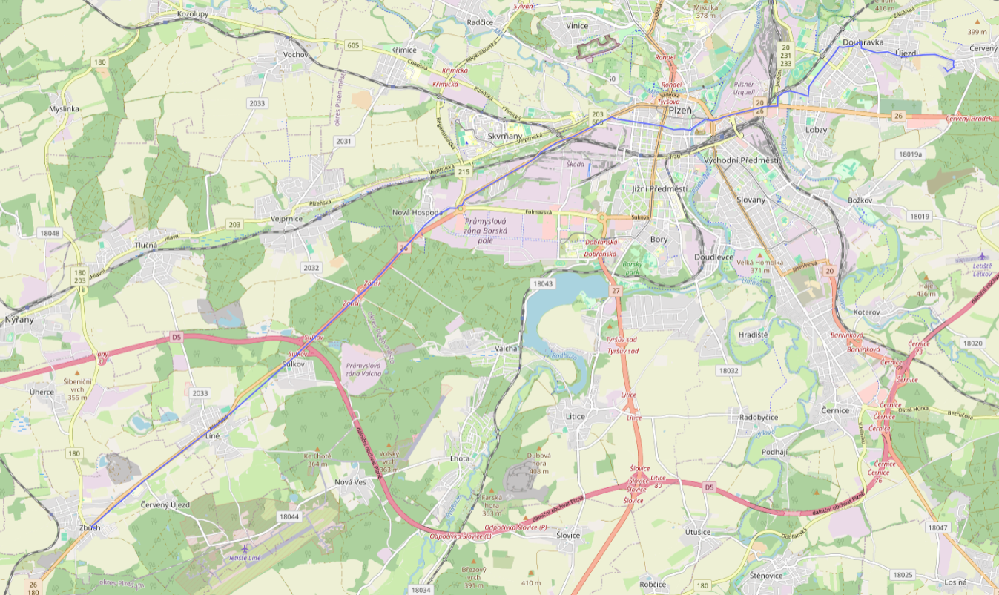
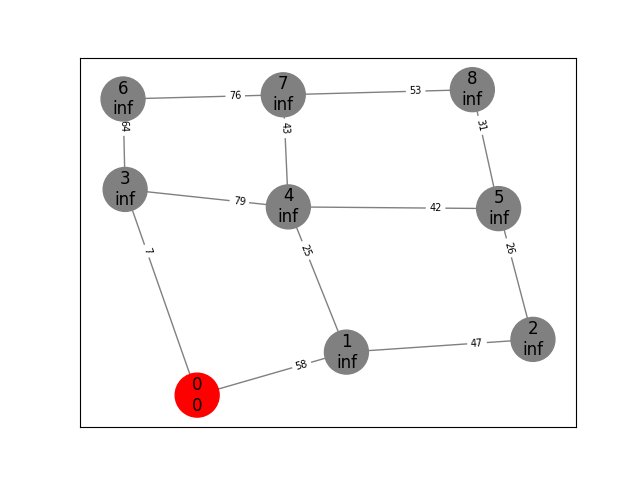
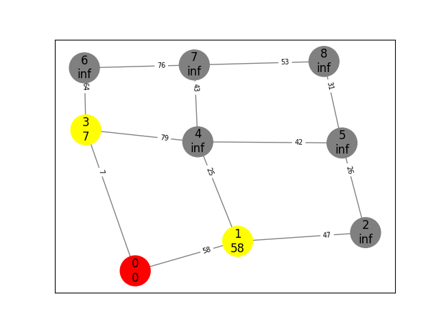
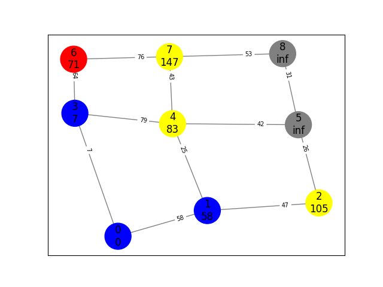
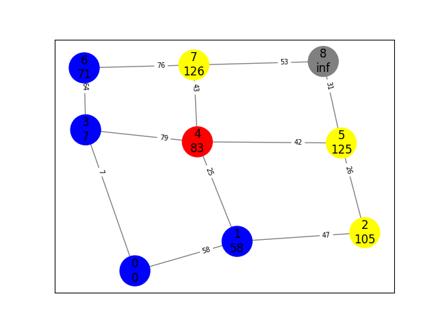

# Nejkratší cesta v grafu

1. Použijme implementaci z předchozího cvičení a přidejme do ni následující funkcionalitu
2. Pro vizualizaci můžeme použít knihovnu adthelpers (viz předchozí cvičení)
    - je možné, že budete potřebovat nainstalovat aktuální verzi pro podporu sledování průběhu dijkstrova algoritmu
3. Implementujme funkcionalitu pro nalezení nalezení nejkratší cesty v grafu Dijkstrovým algoritmem

    ```python
    def dijkstra(graph: Graph, start_id : int, end_id:int) -> tuple[dict[int, float], dict[int, int]]:
    ```

4. Všimněme si, že Prim-Jarníkův algoritmus pro nalezení minimální kostry grafu má velice podobnou strukturu jako Dijkstrův algoritmus pro nalezení nejkratší cesty.
    V čem jsou podobné:
        - oba začínají z jednoho z uzlů a postupně objevují graf pomocí sousedů již objevených uzlů
        - oba používají prioritní frontu pro optimální prohledávání
    V čem se liší:
        - Dijkstrův algoritmus navíc uchovává informaci, odkud jsme uzel objevili
        - Dijkstrův algoritmus namísto samotné ceny hrany používá navíc informaci o vzdálenosti od výchozího bodu

    ```text
    Vstup:
        graf – seznam sousedních uzlů a vah hran
        start_id – ID počátečního uzlu
        end_id – ID cílového uzlu

    Výstup:
        vzdálenosti – nejkratší vzdálenosti od start_id ke všem uzlům
        předchůdci – mapa každého uzlu na jeho předchozí uzel na nejkratší cestě

    Algoritmus:

    1. Vytvoř množinu uzlů, které jsme již navštívili (closed)
    2. Vytvoř prázdný seznam pro hrany ve stromu nejkratších cest (sp_tree)
    3. Inicializuj prioritní frontu (queue)
    4. Inicializuj slovník vzdáleností: 
       - pro každý uzel nastav vzdálenost na nekonečno
       - vzdálenost startovacího uzlu = 0
    5. Inicializuj slovník předchůdců (predecessors) jako prázdný
    6. Do fronty vlož počáteční uzel s nulovou vzdáleností a "předchůdcem" -1
    7. Dokud fronta není prázdná:
        1. Z fronty vyber uzel s nejmenší vzdáleností (current)
        2. Pokud jsme už tento uzel navštívili, pokračuj na další
        3. Pokud je current cílový uzel, ukonči algoritmus (máme nejkratší cestu)
        4. Přidej current do množiny uzavřených uzlů (closed)

        5. Pro každého souseda current, který ještě nebyl uzavřen:
            1. Spočítej novou vzdálenost jako: vzdálenost[current] + váha hrany
            2. Pokud je spočítaná vzdálenost menší než dosavadně uložená:
                - aktualizuj vzdálenost souseda
                - nastav předchůdce souseda na current
                - Vlož souseda do fronty spolu s jeho novou vzdáleností

    8. Po skončení algoritmu vrať slovník vzdáleností a slovník předchůdců
    ```

5. Implementujte funkci

```python
def reconstruct_path(predecessors: dict[int, int], start_id: int, end_id: int) -> list[int]
```

, která z výsledků dijkstrova algoritmu rekonstruuje nejkratší cestu  

## Kdo stíhá

Najděte nejkratší cestu Plzní ze Zbůchu do Červeného hrádku. Jak už tomu s reálnými dodanými daty často bývá, nejsou ve formátu, který se nám hodí.

1. Implementujte funkci `load_graph_csv(filepath)`, která načte data města Plzně z přiložených datových souborů
    - Pro naše účely použijeme pouze několik kusů informace:
        - pro nalezení cesty: pouze informace o hranách - soubor pilsen_edges_nice.csv
            - source - id uzlu, kde hrana začíná
            - target - id uzlu, které hrana končí
            - weight - vzdálenost po silnici mezi uzly v metrech 
        - pro případnou vizualizaci: informaci o uzlech - soubor pilsen_nodes.csv
            - id - id uzlu
            - WKT - geo souřadnice

2. Můžeme použít naši implementaci grafu.
    - Upravme implementaci grafu tak, aby podporovala práci s orientovanými grafy, data z dopravního prostředí jsou totiž ze své podstaty orientovaná (jednosměrky, nájezdy na dálnice, kruhové objezdy...).
    - Například tak, že upravíme konstruktor grafu

    ```text
    pozn. pro tuto trasu je rozdíl jasně patrný, tedy pokud bychom načetli graf jako neorientovaný, zcela jistě bychom jeli 300m v protisměru 
        20301.654166551518 m -- vzdálenost pokud načteme jako orientovaný graph
        20624.748190849365 m -- vzdálenost pokud načteme neorientovaně
    ```

3. Spusťte nalezení nejkratší cestu z Červeného Hrádku (id:4651) do Zbůchu(id:4569)

4. Pokud bychom chtěli cestu vykreslit na mapě, můžeme použít jednoduchou funkci a knihovnu plotly (https://plotly.com/python/lines-on-mapbox/)

    1. Nejprve musíme načíst informace o polohách jednotlivých uzlů.

        ```python

        def load_nodes_metadata(filename: str) -> dict[int, tuple[str, str]]:
            """Načte metadata o uzlech z CSV souboru. V případě GPS dat je možné zobrazit trasu na mapě pomocí plotly express.
            Returns:
                dict[int, tuple[str, str]]: metadata uzlů (id uzlu, [latitude, longitude])
        ```

    2. Použijme následující funkci pro vizualizaci

        ```python
        def show_path(
            node_info: dict[int, tuple[str, str]], # metadata uzlů načtená pomocí load_ndodes_metadata
            path: list[int],
        ):
            """
            Args:
                node_info (dict[int, tuple[str, str]]): metadata uzlů načtená pomocí load_ndodes_metadata
                path (list[int]): cesta získaná pomocí reconstruct_path
            """
            if node_info:
                lats = [float(la) for la, lo in [node_info[p] for p in path]]
                lons = [float(lo) for la, lo in [node_info[p] for p in path]]

                fig = px.line_mapbox(lat=lats, lon=lons, mapbox_style="open-street-map", zoom=12)
                fig.update_layout(margin={"r": 0, "t": 0, "l": 0, "b": 0}, mapbox_center_lat=49.747)
                fig.show()
        ```



6. Najděte opačnou cestu: ze Zbůchu do Čerevného hrádku.  Je cesta stejná? Proč? 

# K zamyšlení
1. Jaký vliv má námi použitá metrika na nalezenou cestu? 
2. Jak by se výsledek změnil, pokud bychom použili jinou metriku? Například bychom uvažovli také počet pruhů, propustnost silnice, nebo povolenou rychlost?
3. Jaký je vztah mezi mezi kostrou a nejkratší cestou?
4. Je např. pravda, že po kostře vede nejkratší cesta mezi vrcholy? 

5. K čemu se dá použít nejkratší cesta?
    - Navigace v libovolném prostředí. (doprava, robotické vysavače, počítačové hry)


# Příklad funkce algoritmu
průchodu graph_grid_s3_3.json 
Cesta z 0 do 5 




- found shortcut from  0  to  1 inf -> 58
- found shortcut from  0  to  3 inf -> 7


- found shortcut from  3  to  6 inf -> 71
- found shortcut from  3  to  4 inf -> 86


- found shortcut from  1  to  2 inf -> 105
- **found shortcut from  1  to  4 86 -> 83**



- found shortcut from  6  to  7 inf -> 147


- **found shortcut from  4  to  7 147 -> 126**
- found shortcut from  4  to  5 inf -> 125


Cíl - 5 - uzavřeno - hotovo


